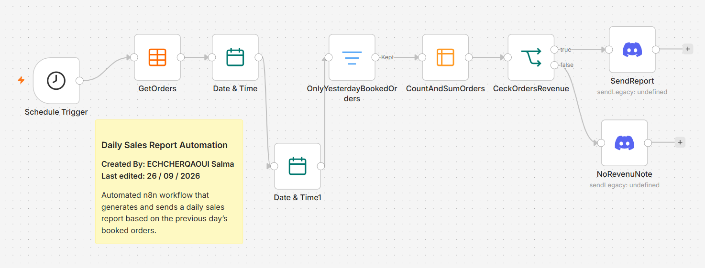

# Daily Sales Report Automation

## Overview
An n8n workflow that automatically generates a daily sales report and sends it to Discord.

## Features
- Runs every day at 9:00 AM
- Filters yesterday's booked orders
- Calculates total orders and revenue
- Sends a sales report or a "no orders" notification

## Workflow
Schedule Trigger → Get Orders → Filter → Summarize → IF → Discord

## Tech Stack
- n8n
- Data Tables
- Discord Webhook
